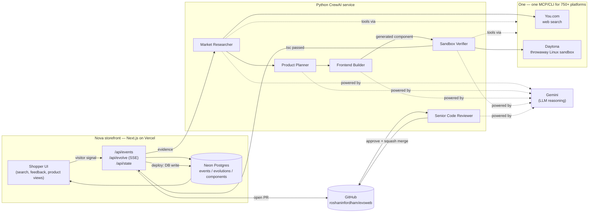

# EvoWeb / Nova — architecture

A minimal storefront that observes real visitor behavior and lets a crew of
agents genuinely build, verify, and ship new UI capabilities into itself —
live, with a real GitHub PR opened and reviewed by a second agent before it
merges. Built for the **You.com × One Hackathon: NYC Edition 002** (theme:
self-repairing & learning agents).

## Flow

## Why it's built this way

- **Slots, not arbitrary code.** The agents can only write into a small set
  of pre-registered "slots" (`price-filter`, `budget-match`,
  `compare-products`), each with a fixed props contract and a fixed set of
  pre-styled primitives (`src/components/slot-kit.tsx`). This is what makes
  "the agent can write real code" safe rather than a stunt.
- **Runtime rendering, not a file the server writes.** Generated code is
  stored in Postgres and compiled client-side (Sucrase, classic JSX runtime)
  the moment it's fetched — `src/components/DynamicSlot.tsx`. This is what
  makes an evolution show up instantly, identically in local dev and once
  deployed, without needing a rebuild.
- **A real, deterministic safety guarantee where it matters.** The
  `budget-match` evolution's "never sell at a loss" rule is enforced in
  plain TypeScript (`src/lib/pricing.ts`), not left to the LLM — the agents
  only decide whether to build the UI and where to look for an external
  alternative when no safe internal discount exists.
- **One MCP/CLI as the single integration surface.** Rather than separate
  SDKs for You.com and Daytona, the crew's tools (`crew/one_tools.py`) shell
  out to the `one` CLI's `search → knowledge → execute` workflow — the
  pattern the hackathon itself is built around.
- **A persistent, pre-provisioned Daytona sandbox.** The first verification
  spent 6+ minutes on Daytona API trial-and-error (sandbox creation,
  install). That sandbox is now reused — write file, run `tsc --noEmit`,
  read the result — so every later evolution verifies in seconds, not
  minutes.
- **The live re-render and the software-factory trail are decoupled.** The
  visible UI update happens the instant verification passes. Opening the
  PR, having a second agent review it, and merging happen as additional SSE
  stages right after — real GitHub activity, without blocking the moment
  the audience actually watches.

## Where each sponsor shows up

| Sponsor | Role | Where in code |
|---|---|---|
| **You.com** | Live web research feeding the Planner (compare-products) and the budget-match external-find path | `crew/pipeline.py::run_plan`, via `crew/one_tools.py` |
| **Daytona** | Real, isolated `tsc --noEmit` execution — the actual safety gate before anything ships | `crew/pipeline.py::run_verify` |
| **CrewAI** | Every agent (Researcher, Planner, Builder, Verifier, Reviewer) is a real `crewai.Agent`/`Task`/`Crew` | `crew/pipeline.py` |
| **One** | The single tool surface the crew's agents use to reach You.com and Daytona | `crew/one_tools.py`, `crew/config.py` |

## Live links

Shown directly in the storefront's engine panel during a demo:
GitHub repo, One dashboard, Daytona dashboard, CrewAI dashboard, plus a
clickable link to the exact PR each evolution opens.
